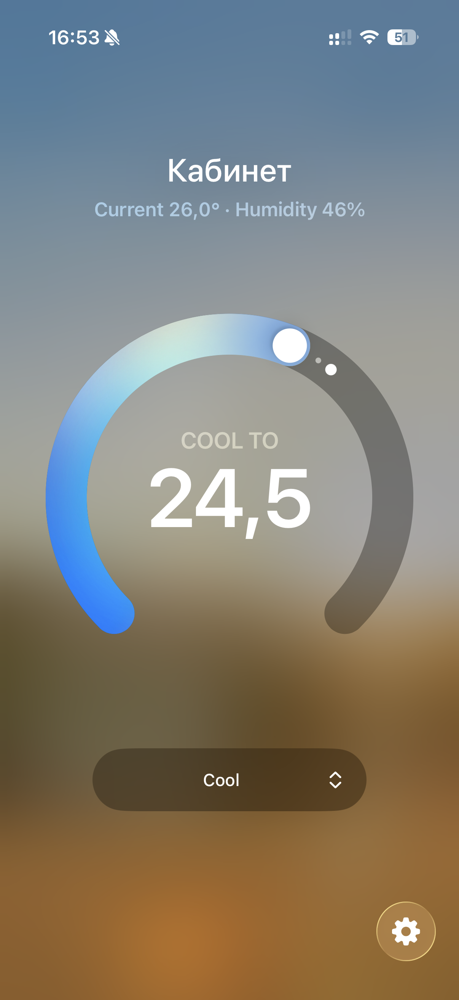
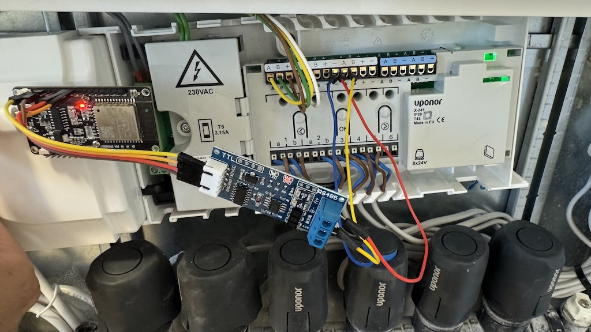

# управление Uponor Smatrix Base Pulse X-245 в Apple Home через ESP32 + RS485

Позволяет управлять через **HomeKit** (приложение «Дом» для iPhone) термостатом Uponor X-245, без отдельного сервера Home Assistant или покупки фирменного модуля Uponor R208 за 400 eur. Исходно собран на базе [ESPHome](https://github.com/esphome/esphome) , откуда взяты знания о протоколе uponor, и потом добавлены наработки [HOMESpan](https://github.com/HomeSpan/HomeSpan). Делал через Claude Code, не спрашивайте меня детальнее, как оно устроено - я не в курсе 😆

Внутри локальной wifi-сети - работает на одном appleID (можно разные девайсы, трубка, мак, etc). Для удаленного (извне дома) управления нужна apple TV или homepod, заодно появляются правила и шаринг другим appleID.

Пароль для начального добавления устройства в Home - 11122333, его можно поменять в src/secrets.h

<table>
  <tr>
    <td></td>
    <td></td>
  </tr>
</table>

## Шина

| Параметр | Значение |
|---|---|
| Физика | RS485, полудуплекс |
| Скорость | 19200, 8N1 |
| Протокол | 4 байта адреса + секции по 3 байта (регистр + 2 байта данных) + CRC16 (modbus-like, little-endian) |
| Опрос | X-245 сам поочерёдно опрашивает термостаты, ESP32 слушает и вклинивается только при записи установки |

Подключаться можно к клеммам **A/B** как на самом X-245, так и на любом термостате — шина общая.

## Железо (работает у автора, возможны другие варианты)

| | |
|---|---|
| Чип | ESP32-D0WD rev v1.0, dual core 240 MHz |
| Flash | 4 MB, 3.3 V |
| PSRAM | нет → **GPIO16/17 свободны** |
| USB-UART | CH340 (`1A86:7523`), драйвер macOS штатный |
| Порт | `/dev/cu.usbserial-XXXX` |
| `board:` | `esp32dev` — верно |

## Распайка (по умолчанию в конфигах)

Модуль — **DollaTek TTL↔RS485 с аппаратным автопереключением направления**
(3.0–30 В питание, логика 3.3 В и 5 В, пинов DE/RE нет).

| Контакт | Откуда | Примечание |
|---|---|---|
| TXD | ESP32 **GPIO16** | выход модуля RS-485 → вход ESP32 |
| RXD | ESP32 **GPIO17** | вход модуля RS-485 ← выход ESP32 |
| VCC | ESP32 **3.3V** | питание модуля RS-485 |
| GND | ESP32 **GND** | связь RS-485 с ESP32 по земле|
| A | RS-485 клемма **A** на X-245 | |
| B | RS-485 клемма **B** на X-245 | |
| GND | RS-485 клемма **GND** на X-245 |RS-485 обязательно нужен провод от GND на клемму GND X-245, без нее приёмнику не сравнить A и B.|

`flow_control_pin`/DE/RE не нужны — направление модуль переключает сам.
Пины задаются константами `RS485_RX_PIN`/`RS485_TX_PIN` в начале `src/main.cpp`.



## Установка с нуля

Пошаговый порядок настройки для новой системы. Диагностика каждого шага — в разделах
«[Как понять, что всё работает](#как-понять-что-всё-работает)» и
«[Если не работает](#если-не-работает)» ниже.

### Что понадобится

- **ESP32** — проверено на классической плате с чипом WROOM-32 и 4 МБ флеша
  (в PlatformIO это `board = esp32dev`). Другие ESP32 с HomeSpan скорее всего тоже заработают,
  но это дешёвый и обкатанный путь.
- **RS485-модуль с аппаратным автопереключением направления** (без пинов DE/RE) —
  например [DollaTek](https://www.amazon.es/dp/B099DRKBGQ) , им не нужен flow-control пин.
- USB-кабель для первой загрузки прошивки и постоянное питание 5 В (см. ниже).

### Шаг 1 — собрать железо

Распайка — в таблице раздела «[Распайка](#распайка-по-умолчанию-в-конфигах)».
Три места, где ошибаются чаще всего:

1. **Полярность A/B.** Самая частая ошибка. Даёт ровно ноль принятых байтов (`rx=0`). Перепутать местами **безопасно** — RS485 от этого не сгорит; если байтов нет - первым делом поменяй A и B.
2. **Общая земля.** Если ESP32 и X-245 питаются от разных источников, обязательно подключай провод GND модуля RS-485 на клемму GND X-245. Без общей земли приёмнику не с чем сравнивать A и B — тоже `rx=0` или сплошные `00`/`FF`.
3. **Питание модуля RS-485** от 3 до 30 В, отлично заработает от платы ESP32.

Признак живого железа: светодиод RXD на модуле **мигает сам по себе** ещё до прошивки — X-245 непрерывно опрашивает термостаты. Не мигает → проблема, скорее всего, в перепутанных A/B, загружать прошивку рано.

**Питание.** Обычная USB-зарядка 5 В в разъём платы. Важно: **USB-C зарядник в розетку часто не может запитать эту плату** (согласование питания USB-C), а вот через USB-A или прямую подачу 5В на пин VIN — работает всегда.

### Шаг 2 — настроить под свою квартиру

Сначала создай рабочие файлы конфигурации из примеров:

```sh
cp src/config.example.h src/config.h
cp src/secrets.h.example src/secrets.h
```

Дальше правятся два файла:

- **`src/secrets.h`** (в `.gitignore`, создаётся из `secrets.h.example`) —
  Wi-Fi SSID/пароль и код сопряжения HomeKit.
- **[src/config.h](src/config.h)** — всё остальное: пины RS485, часовой пояс,
  имя устройства, поправка установки и таблица зон. Адреса термостатов пока
  оставь как есть — их найдём на следующем шаге.

Поправку `UPONOR_TARGET_TEMP_OFFSET` можно оставить **2**, это сдвиг, который вносит сам UPONOR (сказано в их документации про летний режим).

### Шаг 3 — найти адреса термостатов (discovery)

В [config.h](src/config.h) поставь `DUMP_ENABLED = true`, загрузи прошивку (шаг 4) и открой
`http://uponor.local/status` или сними лог `./capture.sh 30`. Ищи строки:

```
dump 0xAABBCC01: 08=0D42 ... 3B=02CC ... 40=02FF 42=B62A
```

Каждый `0x…` — адрес одного термостата. Выпиши все, впиши в массив `ZONES` в
config.h с именами комнат (латиницей — переименуешь потом в «Доме»), верни
`DUMP_ENABLED = false` и загрузи прошивку заново.

### Шаг 4 — собрать и загрузить прошивку

```sh
source .venv/bin/activate     # окружение PlatformIO
pio run -t upload             # первая загрузка по USB
```

Первая загрузка — по USB. Дальше по воздуху: `pio run -e ota -t upload` (HomeSpan
поднимает свой OTA-сервер). В `platformio.ini` три неочевидные, но необходимые
настройки — если будешь собирать сам с нуля, не убирай их:

1. **Платформа — форк pioarduino, а не реестровый `espressif32`.** HomeSpan 2.1.8
   требует ядро arduino-esp32 ≥ 3.3.0, а реестровый застыл на 2.0.17 и сборка
   падает с `#error ... REQUIRES VERSION 3.3.0 OR GREATER`.
2. **`board_build.partitions = min_spiffs.csv`** — прошивка ~1.4 МБ не влезает в
   раздел по умолчанию 1.31 МБ.
3. **`upload_speed = 115200`** — на скорости по умолчанию 460800 CH340 разрывает связь сразу после
   загрузчика-заглушки (`The chip stopped responding`), хотя чип опознаётся правильно.

(Загрузка по воздуху на macOS идёт системным `/usr/bin/python3` — почему, описано
в комментарии к env `ota` в `platformio.ini`.)

### Шаг 5 — сопряжение с iPhone

После прошивки в логе появится:

```
DEVICE NOT YET PAIRED -- PLEASE PAIR WITH HOMEKIT APP
```

В приложении «Дом» → «Добавить аксессуар» → «Нет кода или не удаётся
отсканировать» → устройство по имени из config.h. Код сопряжения — `HOMEKIT_PAIRING_CODE`
из `src/secrets.h`. Появится мост и по одному термостату на комнату — с установкой,
текущей температурой и влажностью (влажность — в климатической сводке, см. FAQ).

Если «Дом» пишет «Не удаётся добавить аксессуар», хотя устройство не сопряжено —
на плате могло застрять незавершённое сопряжение. Стереть: команда `U` в Serial (пример в
`NOTES.md`), Wi-Fi при этом не теряется.

### Шаг 6 — сверить и откалибровать

Открой панель термостата в «Доме» и сравни установку с экраном физического пульта в
той же комнате. Если расходятся на постоянную величину — это и есть
`UPONOR_TARGET_TEMP_OFFSET` (у автора было ровно +2.0 °C, методика — в
разделе «[Сдвиг установки](#сдвиг-установки-2-c)»). Впиши измеренное в config.h и
загрузи прошивку заново. Если сходятся — оставь 0.

## Как понять, что всё работает

Четыре ступени, каждая проверяется отдельно. Ломается почти всегда на первой.

### 1. Есть ли вообще сигнал

На модуле два индикатора — RXD и TXD. X-245 опрашивает термостаты непрерывно,
поэтому **светодиод приёма должен мигать сам по себе**, ещё до всякой прошивки.
Не мигает → проблема чисто в железе, лог смотреть незачем.

### 2. Байты доходят до ESP32

Прошивка сама печатает счётчики раз в 15 с (`UponorBus::logStats()`):

```
[uponor] bus rx=8421 bytes, packets=137, discarded=0, buffered=0, timeMaster=yes
[uponor] last bytes: AA BB CC 01 3B 00 00 3B 02 60 2F A5
```

Читается так:

| Что видно | Что значит |
|---|---|
| `rx=0` или единичные байты | трафика с шины нет — это ступень 1, железо |
| `rx` растёт, `packets=0` | байты идут, пакеты не собираются: земля, скорость, полярность |
| `discarded` растёт | пакеты рвутся — цикл не успевает считывать UART |
| `packets` растёт | пакеты разбираются, всё хорошо |

Лог снимается со сбросом платы — без сброса порт молчит:

```sh
./capture.sh 30
```

### 3. Значения настоящие

Раз в 15 с прошивка печатает состояние всех зон:

```
[uponor] Living  0xAABBCC01 temp=25.6 target=20.5 hum=34 mode=COOL state=2
```

`temp=20.0 target=20.0 hum=0` у всех зон сразу — это **значения по умолчанию из конструктора**,
то есть с шины ещё ничего не пришло. Настоящие значения всегда разные по комнатам.

### 4. Управление доходит до термостата

Изменение установки в «Доме» печатает отправленный пакет:

```
[uponor] 0xAABBCC01 setpoint -> 16.0 C (raw 608)
```

И должно отразиться на экране самого термостата.

## Что получилось

Шина читается и управляется, обе стороны проверены на живом оборудовании.

| Адрес | Комната | Как определено |
|---|---|---|
| `0xAABBCC01` | Living | **подтверждено** — ручная смена установки отразилась на шине |
| `0xAABBCC02` | Bedroom | **подтверждено** — запись 21.5 совпала с экраном термостата |
| `0xAABBCC03` | Study | выведено: единственная установка, не двигавшаяся ни разу |
| `0xAABBCC05` | Bathroom2 | опознана по температуре воздуха: 25.2 против 26.2 у Bathroom1 |
| `0xAABBCC04` | Bathroom1 | по остатку |

Bathroom2 и Bathroom1 — те два термостата, что не работают: кнопки `+`/`−` не отзываются и
целевое значение на экране не посмотреть. Их установки, 30.5 и 29.5 на экране, оставлены
как есть — похоже на зимнюю настройку прогрева пола, которая сработает, когда в системе
появится тёплая вода. Записывать в них ничего не нужно, но состояние видно в «Доме».

Два нерабочих термостата на шине отвечают, но отличаются от рабочих тремя признаками:
`режим2` = `0x1803` вместо `0x1C03` (сброшен бит `0x0400`), регистр `0x35` = `0x0000`
вместо `0x8000`, регистр `0x3D` = `0x1000` вместо `0x1040`.

**Запись проверена.** Смена установки на 16.0 °C отправила в шину

```
>>> AA BB CC 01 3B 00 00 3B 02 60 2F A5
```

`3B` — регистр установки температуры, `0x0260` = 608 = 60.8 °F = 16.0 °C, затем контрольная сумма.
Контроллер принял, значение вернулось по шине обратно. Модуля с автопереключением
направления для записи достаточно, выводы DE/RE подключать не нужно.

Примечание: во всех примерах дампов адрес показан условно (`AA BB CC …`), поэтому
контрольная сумма в конце приведена лишь для иллюстрации формата и с этими байтами
адреса не сходится.

## Доступ

| | |
|---|---|
| Управление | приложение «Дом» на iPhone (HomeKit, локально по Wi-Fi) |
| Код сопряжения | `HOMEKIT_PAIRING_CODE` в `src/secrets.h` |
| Имя в сети | `uponor.local`, HAP-сервер на порту 80 |
| Wi-Fi | SSID и пароль в `src/secrets.h` |
| Загрузка прошивки | USB: `pio run -t upload`; по воздуху — OTA HomeSpan |
| Serial-лог | `./capture.sh 30` (со сбросом платы) |

Ни Home Assistant, ни своего сервера, ни домена с SSL не требуется: HomeSpan
реализует протокол HomeKit прямо на ESP32, и iPhone общается с платой напрямую.


## Режимы: нагрев и охлаждение

Режим читается из регистра `0x3D` (`UPONOR_ID_DEMAND`):

| Бит | Смысл |
|---|---|
| `0x1000` | установлен → охлаждение, сброшен → нагрев |
| `0x0040` | установлен → зона активна, сброшен → простой |

Наблюдённые значения и что они дают:

| Комната | `0x3D` | Режим | Действие |
|---|---|---|---|
| Living | `0x1044` | COOL | COOLING |
| Bedroom | `0x1040` | COOL | COOLING |
| Study | `0x1040` | COOL | COOLING |
| Bathroom1 | `0x1000` | COOL | IDLE |
| Bathroom2 | `0x1000` | COOL | IDLE |

**Это и объясняет «нерабочие» Bathroom2 и Bathroom1.** Они не сломаны и на шине отвечают
исправно — им **запрещено охлаждение**. У термостата есть штатная настройка, меню
`07 Cooling allowed`:

> In this menu it is set whether cooling is allowed in the room or not.
> (не отображается, если подключён коммуникационный модуль — тогда настройка
> находится в приложении Uponor Smatrix PULSE)

На шине это видно по двум признакам: `0x3F` = `1803` вместо `1C03` (сброшен бит
`0x0400`) и `0x35` = `0000` вместо `8000`.

Проверено экспериментом: Bathroom1 выставили установку 22.0 при комнатных 25.3 —
превышение 3.3 °C, а зона всё равно осталась в простое. По мануалу охлаждение
запускается, когда в комнате примерно на **1 °C выше установки** (при отключённом
autobalancing), так что порог был пройден с запасом — значит дело именно в запрете,
а не в гистерезисе. Запись установки по шине при этом **проходит и удерживается** —
блокировка только на физическом пульте.

Почему так сделано: напольное охлаждение в санузлах отключают из-за риска
конденсата. У Uponor для этого есть и отдельный механизм — охлаждение комнаты
глушится по влажности:

> Cooling is shut off on a per room basis when the relative humidity limit is
> reached (set in the Uponor Smatrix PULSE app, default 75%).

В нашем случае это не он: влажность в санузлах 44–57 %, далеко до 75 %. То есть
причина — именно запрет в настройке комнаты.

**Режим не переключаемый.** Нагрев и охлаждение задаёт контроллер X-245 на всю
систему, а не покомнатно, и в шину режим не пишется вообще. В HomeKit убрать
характеристику режима нельзя (обязательная), поэтому у неё снято право записи
(`removePerms(PW)` в `uponor_zone.cpp`): переключатель в «Доме» виден, но неактивен
и только отражает фактический режим шины.

Это подтверждено мануалом — у термостата есть меню `02 Heating/cooling changeover`,
и оно **не отображается**, если термостат зарегистрирован на контроллере:

> This menu is not visible if the thermostat is registered to a room controller.
> Heating/cooling changeover will be controlled by a physical heating/cooling
> switch or in the Uponor Smatrix PULSE app.

**Чем переключается режим — четыре штатных способа** (мануал, «Heating/cooling
switch»):

> The heating/cooling switch is manually controlled through the Uponor Smatrix
> PULSE app (which controls the whole system), an external signal, **the supply
> temperature**, or depending on the **indoor/outdoor temperature**.

То есть система **умеет** переключаться сама — по температуре теплоносителя или по
внутренней/наружной температуре, а не только вручную из приложения. Один внешний
сигнал можно подать сразу на четыре контроллера Base.

**ECO** определяется по биту `0x0008` регистра `0x3E`, величина отката — регистр
`0x3C` (у нас `0x0048` = 7.2 °F = ровно 4.0 K, что совпадает со значением по
умолчанию из документации). Мануал, меню `03 ECO mode setback temperature`
(по умолчанию 4 °C, диапазон 0–11 °C):

> The setting adjusts the current setpoint with the set value. **In heating mode
> the setpoint is reduced, and in cooling mode it is increased.**

⚠️ **В коде это учтено неверно:** откат **всегда вычитается**, тогда как в режиме
охлаждения его надо **прибавлять**. Сейчас ошибка не проявляется — ECO не активен
(`0x3E = 0000` у всех зон), но проявится, когда включится расписание или Forced ECO.
Та же природа, что у ошибки с offset (см. ниже): правило зависит от режима, а мы
применяем его односторонне.

## Сдвиг установки +2 °C

**Экран термостата = значение регистра `0x3B` с шины + 2.0 °C.** Измерено по четырём
точкам, плечо 316 единиц raw:

| raw | На термостате | Стандартная формула | Разница |
|---|---|---|---|
| 545 | 14.5 | 12.500 | +2.000 |
| 608 | 18.0 | 16.000 | +2.000 |
| 636 | 19.5 | 17.556 | +1.944 |
| 861 | 32.0 | 30.056 | +1.944 |

Наклон совпадает с формулой `°F/10` точно (расхождение 0.30 % — это округление экрана
до 0.5), расходится только свободный член, ровно на 2.0000 °C = 3.6 °F = 36 единиц raw.
То есть это **не** ошибка пересчёта: при неверной формуле поехал бы наклон и разница
на 14.5 отличалась бы от разницы на 32.

Сдвинут только регистр установки. Проверено, что **не** сдвинуты:

- `0x40` температура воздуха — 25.78 по формуле против 25.7 на экране
- `0x37`/`0x38` границы — 5.0/35.0 против пределов термостата 5 и 35

Поэтому поправка применяется только на пути установки (чтение и запись), а общая
функция `uponor_raw_to_celsius` не тронута — правка в ней сдвинула бы и температуру,
и границы. Константа одна: `UPONOR_TARGET_TEMP_OFFSET` в
[src/uponor_protocol.h](src/uponor_protocol.h).

Поправка перепроверена в нескольких точках **внутри режима охлаждения**: на шине
`raw ≈ 635` → 17.5 по формуле → 19.5 с поправкой, и термостат Living показывает
ровно 19.5. Внимание: это проверка внутри COOL, **между нагревом и охлаждением
сдвиг не проверялся** — и по документации он там меняет знак (см. ниже).


### Причина сдвига — документированный параметр Uponor «Heating/cooling offset»

**Разгадано** (спасибо документации Uponor на страницу X-245). Это штатный
параметр системы, а не артефакт и не калибровка датчика:

> Uponor uses an offset temperature to adjust the setpoints when switching
> between heating and cooling. **The offset is 2 °C and is used to increase the
> setpoints when switching to cooling. When switching back to heating, the value
> is used to reduce the setpoint.** (параметр вида `DI0000012`, по умолчанию 2 °C)

Всё сходится: в регистре `0x3B` лежит **базовая** установка, а термостат в режиме
охлаждения показывает и применяет **эффективную = базовая + 2**. Отсюда наше
«экран = шина + 2». И это снимает обе прежние нестыковки:

- **«ровно 2.00 в Цельсиях на Фаренгейтовой шине»** — потому что offset задан
  отдельным параметром в °C, а не выведен из пересчёта °F.
- **граница `0x38` не сдвинута** — offset применяется к setpoint, а не к
  границам; мы их и не трогали, и это оказалось правильно.

**⚠️ Важно для зимы: offset меняет направление в heating.** Документация прямо
говорит — при переключении обратно в нагрев значение **уменьшает** установку. А в
коде `UPONOR_TARGET_TEMP_OFFSET` прибавляется **жёстко, независимо от режима**.
Все измерения делались в COOL (система всё лето охлаждает), heating-данных нет.
Значит:

- летом (COOL) `+2` **верно** — проверено на четырёх точках;
- зимой (HEAT) `+2` **почти наверняка неверно** — ошибка до 4 °C (если
  эффективная = базовая − 2) или 2 °C (если offset в heating снимается).

Что с этим делать (код пока НЕ трогаем — лето работает, менять вслепую нельзя):
1. посмотреть параметр в приложении Uponor Smatrix Pulse / меню контроллера —
   возможно, offset там **настраивается**, и его можно обнулить в самой системе,
   тогда нашу поправку убрать совсем (идеальный исход);
2. либо снять данные при переключении в HEAT (дамп + сравнение экрана с `0x3B`) и
   сделать offset режим-зависимым.

Известный край: запрос 5 °C из «Дома» уйдёт в шину как 3 °C, ниже минимума
устройства. Верхний край проверен, 35 проходит. Официальный диапазон установки —
**5–35 °C** («maximum and minimum setting may be limited by other system
settings»); в HomeKit мы снизу ограничены 10 °C, потому что таков минимум
спецификации HAP.


### Прочее из мануала, полезное для диагностики

- **Порог запуска.** При отключённом autobalancing охлаждение (и нагрев) стартует,
  когда комната примерно на **1 °C** отошла от установки. Полезно, когда зона в
  простое, а кажется, что должна работать.
- **Autobalancing** (включён по умолчанию) — система сама считает потребность
  комнаты и управляет приводами ШИМ, время открытия зависит от длины петли. Поэтому
  `0x0040` (зона активна) мигает не «по термостату», а по расчёту контроллера.
- **Heating fallback.** Если связь с термостатом потеряна, контроллер открывает
  привод по расписанию-интервалу, пока термостат не вернётся. То есть тишина на
  шине по одной зоне не означает, что отопление в ней встало.
- **Влажность.** Охлаждение комнаты глушится при достижении лимита RH (по умолчанию 75 %,
  «Deadzone» 5 %). У нас 39–57 %, так что не срабатывает — но если однажды зона
  встанет при высокой влажности, причина может быть в этом.
- **Room bypass** — до двух комнат на контроллер могут в режиме нагрева работать
  как байпас для поддержания минимального протока. Ещё одна причина, по которой
  зона может открыться «без запроса» от термостата.

### Расшифровка регистров

Температуры лежат в десятых долях **Фаренгейта**, прошивка сама переводит в Цельсий
(`raw/10` °F → °C). Влажность — **младший байт** регистра `0x42`: `0xB622` → 34 %.

| Рег | Смысл |
|---|---|
| `0x2D` | наружная температура |
| `0x37` / `0x38` | границы установки (5.0 / 35.0 °C) |
| `0x3B` | установка |
| `0x3C` | ECO-откат, **разность**, а не абсолют: `0x0048` = 7.2 °F = 4.0 K |
| `0x3D` | запрос тепла |
| `0x3E` / `0x3F` | режим 1 / 2 |
| `0x40` | температура в комнате |
| `0x41` | внешний датчик (`0x7FFF` = не подключён) |
| `0x42` | влажность |

Регистр `0x41` у всех пяти отдаёт `0x7FFF` — внешних и напольных датчиков нет,
поэтому внешняя температура в HomeKit не заведена.

### Если не работает

| Что в логе | Причина |
|---|---|
| `rx=0` или единичные байты | перепутаны A и B — поменяй местами; либо TXD модуля не на GPIO16; либо модуль без питания |
| Одни `00` или одни `FF` | нет общей земли с X-245, или A/B висят в воздухе |
| `rx` растёт, `packets=0` | пакеты рвутся: проверь землю и длину провода, скорость строго 19200 8N1 |
| `discarded` растёт | цикл не успевает считывать UART — поднять RX-буфер в `UponorBus::begin()` |
| Значения `temp=20.0 target=20.0 hum=0` у всех зон | это значения по умолчанию, с шины не пришло ничего — смотри строки выше |

Полярность A/B — самая частая ошибка, и она даёт именно ноль байтов, а не мусор.
Перепутать местами безопасно, RS485 от этого не горит.

## Файлы

| Файл | Назначение |
|---|---|
| [platformio.ini](platformio.ini) | платформа, разделы флеша, скорость загрузки |
| [src/main.cpp](src/main.cpp) | мост + 5 зон, Wi-Fi, NTP, пины RS485, печать состояния |
| [src/uponor_protocol.h](src/uponor_protocol.h) / [.cpp](src/uponor_protocol.cpp) | шина: пакеты, CRC16, очередь, регистры, поправка +2 °C |
| [src/uponor_zone.h](src/uponor_zone.h) / [.cpp](src/uponor_zone.cpp) | HomeKit-термостат на зону |
| `src/secrets.h` | Wi-Fi и код сопряжения, в `.gitignore` |
| [capture.sh](capture.sh) | снять лог со сбросом платы: `./capture.sh 30` |
| `.venv/` | окружение PlatformIO |

Без сброса платы порт молчит — после загрузки устройство печатает только по таймеру.
Поэтому лог снимается `capture.sh`, который дёргает EN через RTS.

## FAQ
Вопросы, которые всплыли на живой системе.

### Установка в «Доме» сама изменилась, я её не трогал — это баг?

Нет. У программируемых термостатов Uponor есть **недельное расписание**
(comfort/eco по времени и дням). Оно живёт **в самом термостате**, а прошивка
лишь читает с шины *текущую* действующую установку и отражает её. Когда расписание
в свой момент переключает период — установка меняется, и «Дом» честно это
показывает.


### Можно ли настроить недельную программу через «Дом»?

Нет. У HomeKit-термостата нет понятия недельного расписания. Программа задаётся
на пульте термостата или в приложении Uponor Smatrix Pulse. Прошивка её не трогает
и не может — по шине сама таблица «дни × часы» вообще не передаётся, только
текущие значения. Наблюдать *эффекты* расписания можно (включить `DUMP_ENABLED` на
сутки и ловить, когда меняется регистр `0x3E` и скачет `0x3B`).

### Почему термостат в санузле не даёт сменить установку с пульта?

Потому что в этой комнате **запрещено охлаждение** — это штатная настройка
термостата, меню `07 Cooling allowed` («whether cooling is allowed in the room or
not»); при подключённом коммуникационном модуле она правится в приложении Uponor
Smatrix PULSE. Так обычно делают в санузлах: холодный пол при высокой влажности
даёт конденсат.

Пока вся система в режиме COOL, такая зона не участвует, и пульт не даёт трогать
установку. По шине видно: бит `0x0400` в регистре `0x3F` сброшен (`1803` вместо
`1C03`), `0x35 = 0000`. Запись установки **по шине проходит** — блокировка только на
физическом пульте. Зона снова станет активной, когда система переключится в HEAT.

### Кто и как переключает зиму/лето?

Режим нагрев/охлаждение — **общесистемный**, не покомнатно. По мануалу переключается
четырьмя способами: вручную из приложения Uponor Smatrix PULSE, **внешним сигналом**,
**по температуре теплоносителя** или **по внутренней/наружной температуре**. То есть
система умеет переключаться и автоматически, без ручного вмешательства.

X-245 рассылает текущий режим всем термостатам по шине (бит `0x1000` регистра
`0x3D`). Прошивка режим только читает и показывает — сменить его из «Дома» нельзя
(в протоколе записи режима нет), поэтому переключатель сделан неактивным (read-only).

### Можно ли показать влажность отдельной плиткой в приложении "Дом"?

Нет — Apple Home в принципе не рисует значение датчика влажности на плитке, только
в климатической сводке вверху экрана дома/комнаты. Датчик влажности вложен внутрь
каждого термостата и питает эту сводку. Для покомнатных значений (а не общего
диапазона) — разложи аксессуары по комнатам в самом «Доме».

### Второй телефон не находит устройство. Это однопользовательский режим?

Нет. Плата поддерживает **до 16 контроллеров** (`MAX_CONTROLLERS` в HomeSpan, это
требование HAP). Дело в другом: аксессуар принадлежит **дому**, а не телефону, и
код сопряжения вводится **один раз**.

Что происходит технически:

1. Первый телефон проходит Pair-Setup с кодом и становится **admin**-контроллером.
2. После этого плата объявляет в Bonjour `sf=0` («уже сопряжён») и **отклоняет любые
   новые Pair-Setup** — в логе `*** ERROR: Device already paired!`, по протоколу
   ответ `Error=Unavailable`. Поэтому второй телефон ничего и не находит: устройство
   намеренно перестаёт быть «доступным для добавления».
3. Остальные устройства добавляются **не кодом**, а операцией Add Pairing, которую
   выполняет admin-контроллер по защищённому каналу. Apple делает это сама.

Поэтому второй телефон не надо «привязывать» — ему надо **дать доступ к дому**:

- **своё второе устройство** (тот же Apple ID, iCloud + «Дом» включены) — доступ
  появляется автоматически;
- **другой человек** — «Дом» → «+» → «Добавить пользователя».

Важно: приглашать людей и давать удалённый доступ **можно только при наличии
домашнего центра** (Apple TV или HomePod).


### Сменил сеть на телефоне/Mac — устройство пропало. Почему?

Ожидаемо без домашнего центра. В HomeKit два разных слоя:

- **структура дома** (какие аксессуары, имена, комнаты) синхронизируется через
  **iCloud** и видна всегда, пока есть интернет и тот же Apple ID;
- **управление аксессуаром** (прочитать температуру, задать установку) — это прямое
  соединение устройство ↔ плата по Wi-Fi, оно работает **только пока вы в одной
  локальной сети с платой**.

Ушёл из домашнего Wi-Fi (другая сеть, мобильный интернет, вне дома) — плитки
остаются, но становятся «Нет ответа»: дом на месте, а достучаться до платы нечем.
Документация Apple прямо описывает это как поведение без удалённого доступа
(«control your accessories only while they're at your home and connected to your
Wi-Fi network»).

Домашний центр это и решает: Apple TV или HomePod постоянно находится в домашней сети
рядом с платой, и когда твоё устройство в другой сети, команды идут **через домашний центр**.
Так «только дома» превращается в «откуда угодно».

### Нужен ли Apple TV / HomePod?

Для работы внутри дома — нет, iPhone общается с платой напрямую по Wi-Fi. Домашний
центр нужен для трёх вещей: **удалённого доступа** вне дома, **серверных
автоматизаций** и **приглашения других пользователей** с настройкой их прав.
Прошивку менять не надо — плата остаётся обычным HomeKit-аксессуаром.

Домашним центром может быть только **Apple TV** или **HomePod / HomePod mini**.
**iPad домашним центром быть не может** — это прямо сказано у Apple:

> To share control of your home and receive Home notifications on the latest
> version of Apple Home, you must set up a home hub, like an Apple TV or HomePod.
> **iPad isn't supported as a home hub** on the latest version of Apple Home.
>
> — [Update Apple Home](https://support.apple.com/en-us/102287), Apple Support

Поддержка прежней версии Apple Home (где iPad ещё работал домашним центром) прекращена
**10 февраля 2026**. Та же формулировка про iPad повторяется в статье про ошибку
[«Home Hub Required»](https://support.apple.com/en-us/102096).


### Что нужно, чтобы поднять это на своей системе Uponor?

ESP32 (проверено на классической WROOM-32, 4 МБ) + RS485-модуль с аппаратным
автопереключением направления. Дальше правится один файл [src/config.h](src/config.h):
адреса термостатов (ищутся через `DUMP_ENABLED`), имена комнат, часовой пояс,
пины и поправка установки — **её на чужой системе сначала поставь 0** и сверь с
экраном пульта (у автора было 2 °C, ровно документированное значение offset по умолчанию).

## Официальные источники

Расшифровка поведения системы в этом README опирается на документацию Uponor —
там же можно проверить цитаты:

- **Uponor Smatrix Base PULSE — Installation and operation manual** (96 стр.,
  артикул 1095345): описание Comfort/ECO, heating/cooling offset, меню настроек
  термостата `00`–`12`, функция влажности, autobalancing, room bypass.
  [PDF](https://www.underfloorstore.co.uk/images/products/Uponor_Smatrix_Pulse__Base_Manual_1.pdf)
- **Каталожная страница контроллера X-245** — краткое описание и ссылки на все
  документы.
  [uponor.com](https://www.uponor.com/en-en/product-online-catalogue/heating-cooling-solutions/digital-controls-services/digital-controls/smatrix-base/uponor-smatrix-base-controller-pulse-x-245-bus-6x)

Протокол шины в документации **не описан** — он результат реверс-инжиниринга
(см. ESPHome-компонент `uponor_smatrix`, автор @kroimon). Расшифровки регистров в
этом README получены измерениями на живой системе и сверены с документированным
поведением, где это было возможно.

Про поведение самого HomeKit:

- **Share control of your home** — правила приглашения пользователей и требование
  домашнего центра. [support.apple.com](https://support.apple.com/en-us/102386)
- **Update Apple Home** — какие устройства могут быть домашним центром, почему iPad не может,
  дата прекращения поддержки прежней версии (10.02.2026).
  [support.apple.com](https://support.apple.com/en-us/102287)
- **HomeSpan** — реализация HAP, на которой построена прошивка; в её исходниках
  видны лимиты вида `MAX_CONTROLLERS = 16`.
  [github.com/HomeSpan/HomeSpan](https://github.com/HomeSpan/HomeSpan)
